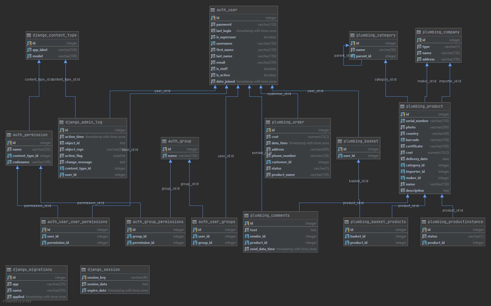

# Интернет-магазин #
```
Использованные технологии:
1) python 3.8.5
2) django REST framework
3) django 
4) django-phone-number
5) django-crripy-forms
6) bootstrap 4
7) postgresql
```
```
Установка:
1) создать venv
2) pip install requirements.txt
3) в файле settings.py изменить настройки бд
```
```
Запуск:
python manage.py runserver
```
```
Запуск тестов:
python manage.py test
```
Диаграммма данных:

